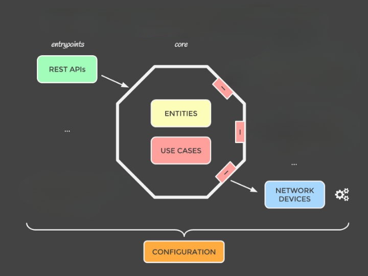

<a name="readme-top"></a>
<!-- TABLE OF CONTENTS -->
<details>
  <summary>Table of Contents</summary>
  <ol>
    <li><a href="#about-the-project">About The Project</a></li>
    <li><a href="#design">Design</a></li>
    <li><a href="#exception-handling">Exception handling</a></li>
    <li><a href="#logging">Logging</a></li>
    <li><a href="#acknowledgments">Acknowledgments</a></li>
  </ol>
</details>


<!-- ABOUT THE PROJECT -->
## About The Project

A new web page where team developers can inform their Github id(login) and recieve advices about how they can improve their own profiles.

<p align="right">(<a href="#readme-top">back to top</a>)</p>

<!-- GETTING STARTED -->
## Getting Started

* This is project is built with .net 6 and angular 15. Make sure you have both installed.
* Using terminal change directory to AlterDomus.UI and run
* npm
  ```sh
  npm install 
  ```
  * After that start backend server from visual studio and start frontend server by running 'ng serve -o'

<p align="right">(<a href="#readme-top">back to top</a>)</p>


## Design


* In this project clean architecture guidelines have been followed and so core does not depend on any other project through dependency inversion. All the components in the project depend on abstractions. Apart from this all other projects communicate together through contracts exposed by core and do not directly call each other.

* Note:No project should use contracts other than those defined by core or it's own at any point in development.

<p align="right">(<a href="#readme-top">back to top</a>)</p>


## Exception handling

In this project since our only entry point is our apis(AlterDomusAssignment project) we are handling all exceptions using a basic custom exception handling middleware. And with the logic in place any exception resulting during request processing would be handled by the middleware and it would send a response of status code(default 500) and exception message to the client eg:
```
{
      message:"file cannot be found",
      statusCode:500
}
```
If we want to set statusCode we can do so by throwing an httpException along with status code we want the client to see and middleware will create the appropriate response accordingly.
<p align="right">(<a href="#readme-top">back to top</a>)</p>


## Logging

* We are using logging mechanism provided out of the box by dotnet and any new provider can be added as microsoft suggests.
* As of now application insights is configured and being used by the application. So any logging along with monitoring can be accessed on azure application insights.
<p align="right">(<a href="#readme-top">back to top</a>)</p>


